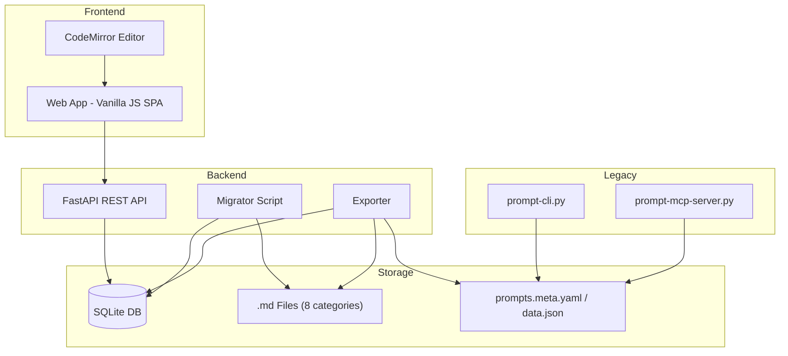
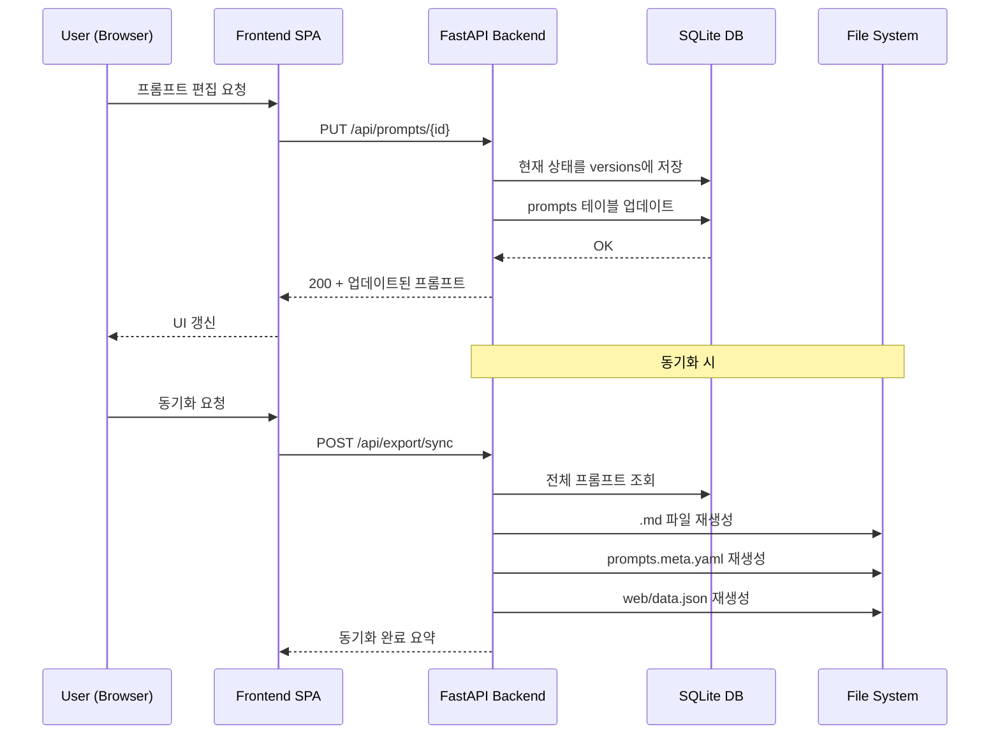
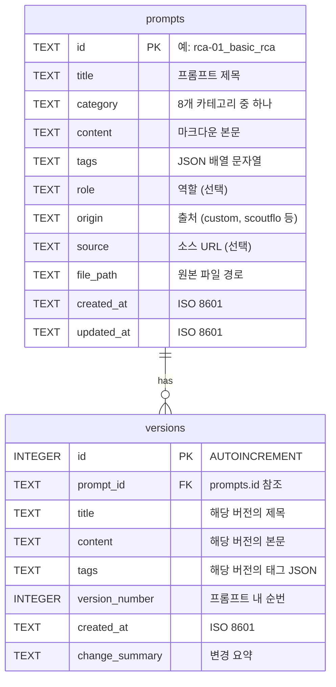

# Design Document: Prompt Management App

## Overview

기존 마크다운 파일 기반 프롬프트 라이브러리(461개, 8개 카테고리)를 SQLite DB 기반 관리 앱으로 전환한다. 시스템은 세 개의 주요 레이어로 구성된다:

1. **데이터 레이어**: SQLite DB (prompts + versions 테이블), 마이그레이션/익스포트 스크립트
2. **API 레이어**: FastAPI 백엔드 (REST API, CRUD, 버전 관리, 동기화)
3. **프론트엔드 레이어**: 기존 바닐라 JS SPA 확장 (편집 모드, CodeMirror 에디터, 버전 히스토리 UI)

기존 CLI(`prompt-cli.py`)와 MCP 서버(`prompt-mcp-server.py`)는 파일 기반으로 계속 동작하며, DB → 파일 익스포트 + 동기화 API를 통해 호환성을 유지한다.



## Architecture

### 디렉토리 구조

```
project-root/
├── backend/
│   ├── main.py              # FastAPI 앱 엔트리포인트
│   ├── database.py           # SQLite 연결 및 테이블 초기화
│   ├── models.py             # Pydantic 모델 (요청/응답 스키마)
│   ├── routers/
│   │   ├── prompts.py        # /api/prompts CRUD 라우터
│   │   ├── versions.py       # /api/prompts/{id}/versions 라우터
│   │   └── export.py         # /api/export 라우터
│   ├── services/
│   │   ├── prompt_service.py # 프롬프트 비즈니스 로직
│   │   ├── version_service.py# 버전 관리 로직
│   │   └── export_service.py # 익스포트/동기화 로직
│   └── migrate.py            # .md → DB 마이그레이션 스크립트
├── web/
│   ├── index.html            # 확장된 SPA HTML
│   ├── app.js                # 확장된 SPA 로직
│   ├── editor.js             # CodeMirror 에디터 모듈
│   ├── versions.js           # 버전 히스토리 UI 모듈
│   ├── styles.css            # 확장된 스타일
│   └── data.json             # (익스포트 시 재생성)
├── prompts.db                # SQLite 데이터베이스 파일
└── scripts/                  # 기존 CLI, MCP 서버 (변경 없음)
```

### 기술 스택

| 컴포넌트 | 기술 | 버전 |
|----------|------|------|
| Backend | Python FastAPI | 0.115+ |
| Database | SQLite (aiosqlite) | 3.35+ |
| Frontend | Vanilla JS SPA | ES2020+ |
| Editor | CodeMirror 6 | 6.x |
| Markdown Render | marked.js | 12.x (기존) |
| Syntax Highlight | highlight.js | 11.x (기존) |

### 요청 흐름




## Components and Interfaces

### 1. Database Layer (`backend/database.py`)

SQLite 연결 관리 및 테이블 초기화를 담당한다.

```python
# 핵심 인터페이스
async def get_db() -> aiosqlite.Connection  # FastAPI 의존성 주입용
async def init_db() -> None                  # 테이블 생성 (앱 시작 시 호출)
```

테이블 생성 SQL:

```sql
CREATE TABLE IF NOT EXISTS prompts (
    id         TEXT PRIMARY KEY,
    title      TEXT NOT NULL,
    category   TEXT NOT NULL,
    content    TEXT NOT NULL,
    tags       TEXT NOT NULL DEFAULT '[]',   -- JSON 배열 문자열
    role       TEXT DEFAULT '',
    origin     TEXT DEFAULT '',
    source     TEXT DEFAULT '',
    file_path  TEXT DEFAULT '',
    created_at TEXT NOT NULL,                -- ISO 8601
    updated_at TEXT NOT NULL                 -- ISO 8601
);

CREATE INDEX IF NOT EXISTS idx_prompts_category ON prompts(category);
CREATE INDEX IF NOT EXISTS idx_prompts_updated ON prompts(updated_at);

CREATE TABLE IF NOT EXISTS versions (
    id             INTEGER PRIMARY KEY AUTOINCREMENT,
    prompt_id      TEXT NOT NULL REFERENCES prompts(id) ON DELETE CASCADE,
    title          TEXT NOT NULL,
    content        TEXT NOT NULL,
    tags           TEXT NOT NULL DEFAULT '[]',
    version_number INTEGER NOT NULL,
    created_at     TEXT NOT NULL,
    change_summary TEXT DEFAULT ''
);

CREATE INDEX IF NOT EXISTS idx_versions_prompt ON versions(prompt_id);
CREATE UNIQUE INDEX IF NOT EXISTS idx_versions_unique 
    ON versions(prompt_id, version_number);
```

### 2. Pydantic Models (`backend/models.py`)

```python
class PromptBase(BaseModel):
    title: str
    category: str
    content: str
    tags: list[str] = []
    role: str = ""

class PromptCreate(PromptBase):
    id: str | None = None  # 자동 생성 가능

class PromptUpdate(BaseModel):
    title: str | None = None
    content: str | None = None
    category: str | None = None
    tags: list[str] | None = None
    role: str | None = None
    change_summary: str = ""

class PromptResponse(PromptBase):
    id: str
    origin: str
    source: str
    file_path: str
    created_at: str
    updated_at: str

class PromptListItem(BaseModel):
    id: str
    title: str
    category: str
    tags: list[str]
    role: str
    origin: str
    updated_at: str

class PromptListResponse(BaseModel):
    total: int
    page: int
    page_size: int
    prompts: list[PromptListItem]

class VersionResponse(BaseModel):
    id: int
    prompt_id: str
    title: str
    content: str
    tags: list[str]
    version_number: int
    created_at: str
    change_summary: str

class ExportSummary(BaseModel):
    total_exported: int
    output_directory: str
```

### 3. REST API Routers

#### Prompts Router (`backend/routers/prompts.py`)

| Method | Endpoint | 설명 | 응답 |
|--------|----------|------|------|
| GET | `/api/prompts` | 목록 조회 (페이지네이션, 필터) | `PromptListResponse` |
| GET | `/api/prompts/{id}` | 단건 조회 (content 포함) | `PromptResponse` |
| POST | `/api/prompts` | 생성 | `PromptResponse` (201) |
| PUT | `/api/prompts/{id}` | 수정 (버전 자동 생성) | `PromptResponse` |
| DELETE | `/api/prompts/{id}` | 삭제 (연관 버전 포함) | 204 |

쿼리 파라미터 (`GET /api/prompts`):
- `q`: 검색어 (title, content LIKE 검색)
- `category`: 카테고리 필터
- `tag`: 태그 필터
- `page`: 페이지 번호 (기본 1)
- `page_size`: 페이지 크기 (기본 50)

#### Versions Router (`backend/routers/versions.py`)

| Method | Endpoint | 설명 | 응답 |
|--------|----------|------|------|
| GET | `/api/prompts/{id}/versions` | 버전 목록 | `list[VersionResponse]` |
| GET | `/api/prompts/{id}/versions/{ver}` | 특정 버전 조회 | `VersionResponse` |
| POST | `/api/prompts/{id}/versions/{ver}/restore` | 버전 복원 | `PromptResponse` |

#### Export Router (`backend/routers/export.py`)

| Method | Endpoint | 설명 | 응답 |
|--------|----------|------|------|
| GET | `/api/export` | 전체 .md 파일 익스포트 | `ExportSummary` |
| POST | `/api/export/sync` | meta.yaml + data.json 재생성 | `ExportSummary` |

### 4. Service Layer

#### PromptService (`backend/services/prompt_service.py`)

```python
async def list_prompts(db, q, category, tag, page, page_size) -> PromptListResponse
async def get_prompt(db, prompt_id) -> PromptResponse | None
async def create_prompt(db, data: PromptCreate) -> PromptResponse
async def update_prompt(db, prompt_id, data: PromptUpdate) -> PromptResponse | None
async def delete_prompt(db, prompt_id) -> bool
```

#### VersionService (`backend/services/version_service.py`)

```python
async def create_version(db, prompt_id, current_prompt) -> VersionResponse
async def list_versions(db, prompt_id) -> list[VersionResponse]
async def get_version(db, prompt_id, version_number) -> VersionResponse | None
async def restore_version(db, prompt_id, version_number) -> PromptResponse | None
```

#### ExportService (`backend/services/export_service.py`)

```python
async def export_all_to_md(db, output_dir) -> ExportSummary
async def sync_meta_files(db, project_root) -> ExportSummary
def format_prompt_as_md(prompt: PromptResponse) -> str  # YAML frontmatter + body
def parse_md_file(file_path: Path) -> PromptCreate      # .md → PromptCreate
```

### 5. Migrator (`backend/migrate.py`)

독립 실행 스크립트로, 기존 .md 파일을 DB로 임포트한다.

```python
def scan_md_files(root: Path, categories: list[str]) -> list[Path]
def parse_frontmatter(content: str) -> dict
def parse_md_to_prompt(file_path: Path, category: str) -> PromptCreate
async def migrate_all(db_path: str, root: Path) -> MigrationSummary
```

실행: `python -m backend.migrate`

### 6. Frontend Modules

#### `web/app.js` 확장

기존 읽기 전용 SPA에 다음 기능을 추가:
- API 기반 데이터 로딩 (`fetch('/api/prompts')` → 기존 `data.json` 대체)
- CRUD 버튼 (새 프롬프트, 편집, 삭제)
- 편집 모드 전환 (뷰어 ↔ 에디터)
- 폼 유효성 검사 및 에러 표시

#### `web/editor.js`

CodeMirror 6 기반 마크다운 에디터 모듈:
- 마크다운 구문 강조 (headings, bold, italic, code blocks, lists)
- 실시간 미리보기 (200ms 디바운스, marked.js 렌더링)
- 코드 블록 언어별 하이라이팅 (python, yaml, json, bash, javascript)
- 붙여넣기 시 원본 포맷 유지

```javascript
// 핵심 인터페이스
function createEditor(container, options) -> EditorView
function getContent(editor) -> string
function setContent(editor, content) -> void
function setupPreview(editor, previewContainer) -> void
```

#### `web/versions.js`

버전 히스토리 UI 모듈:
- 버전 목록 패널 (version_number, created_at, change_summary)
- 버전 내용 미리보기
- "이 버전으로 복원" 버튼 + 확인 다이얼로그

```javascript
// 핵심 인터페이스
async function loadVersions(promptId) -> void
async function showVersion(promptId, versionNumber) -> void
async function restoreVersion(promptId, versionNumber) -> void
```


## Data Models

### SQLite 스키마 ERD



### 데이터 변환 흐름

#### .md 파일 → DB (마이그레이션)

```
.md 파일 구조:
---
category: rca
tags: [kubernetes, pod]
role: SRE
origin: custom
source: ""
---
# 제목
본문 내용...

→ prompts 테이블:
  id: "rca-01_basic_rca" (카테고리 접두사 + 파일명)
  title: "기본 RCA (5-Whys + CoT)" (본문 H1에서 추출)
  category: "rca"
  content: "# 제목\n본문 내용..."
  tags: '["kubernetes", "pod"]'
  role: "SRE"
  origin: "custom"
  file_path: "rca/01_basic_rca.md"
```

#### DB → .md 파일 (익스포트)

```
prompts 테이블 레코드 → .md 파일:

---
category: {category}
origin: {origin}
source: {source}
tags: {tags as YAML list}
role: {role}
---
{content}
```

### 카테고리 상수

```python
CATEGORIES = [
    "rca", "incident-response", "application", "infrastructure",
    "security", "data-ai", "shared", "techniques"
]
```

### ID 생성 규칙

- 마이그레이션 시: 기존 `rebuild-index.py` 로직 유지 → `{cat[:3]}-{filename[:40]}`
- 신규 생성 시: `{category[:3]}-{slugified_title}` (중복 시 숫자 접미사)


## Correctness Properties

*A property is a characteristic or behavior that should hold true across all valid executions of a system — essentially, a formal statement about what the system should do. Properties serve as the bridge between human-readable specifications and machine-verifiable correctness guarantees.*

### Property 1: 마이그레이션 라운드트립 (Import/Export Round-Trip)

*For any* 유효한 YAML frontmatter와 마크다운 본문을 가진 .md 파일에 대해, 해당 파일을 DB로 임포트한 후 다시 .md 파일로 익스포트하면, 원본 파일과 동등한 내용(frontmatter 필드 + 본문)이 생성되어야 한다.

**Validates: Requirements 2.2, 2.3, 2.6, 5.1, 5.2, 5.3**

### Property 2: CRUD 라운드트립 (Create-Read Equivalence)

*For any* 유효한 프롬프트 데이터(title, category, content, tags)에 대해, POST /api/prompts로 생성한 후 GET /api/prompts/{id}로 조회하면, 생성 시 전달한 모든 필드 값이 동일하게 반환되어야 한다.

**Validates: Requirements 3.5, 3.6**

### Property 3: 검색 결과 정확성 (Search Filter Correctness)

*For any* 프롬프트 집합과 검색어 q에 대해, GET /api/prompts?q={q}가 반환하는 모든 프롬프트는 title 또는 content에 해당 검색어를 포함해야 한다. 마찬가지로, category 필터 시 모든 결과는 해당 카테고리여야 하고, tag 필터 시 모든 결과는 해당 태그를 포함해야 한다.

**Validates: Requirements 3.2, 3.3, 3.4**

### Property 4: 페이지네이션 일관성 (Pagination Consistency)

*For any* 프롬프트 집합에 대해, 모든 페이지를 순회하여 수집한 프롬프트 ID 집합은 전체 프롬프트 ID 집합과 동일해야 하며, 페이지 간 중복이 없어야 한다.

**Validates: Requirements 3.1**

### Property 5: 업데이트 시 버전 자동 생성 (Update Creates Version)

*For any* 기존 프롬프트에 대해, PUT /api/prompts/{id}로 업데이트하면, (1) 업데이트 전 상태가 versions 테이블에 새 레코드로 저장되어야 하고, (2) 프롬프트의 updated_at이 갱신되어야 하며, (3) version_number는 해당 prompt_id 내에서 단조 증가해야 한다.

**Validates: Requirements 3.7, 4.1, 4.2**

### Property 6: 버전 복원 라운드트립 (Version Restore Round-Trip)

*For any* 프롬프트와 해당 프롬프트의 기존 버전에 대해, 해당 버전으로 복원(POST /api/prompts/{id}/versions/{ver}/restore)하면, (1) 프롬프트의 현재 content가 해당 버전의 content와 동일해야 하고, (2) 복원 행위 자체가 새로운 버전으로 기록되어야 한다.

**Validates: Requirements 4.4, 4.5**

### Property 7: 삭제 시 연쇄 제거 (Delete Cascades to Versions)

*For any* 버전이 존재하는 프롬프트에 대해, DELETE /api/prompts/{id} 후 해당 프롬프트와 모든 연관 버전이 DB에서 제거되어야 한다.

**Validates: Requirements 3.8**

### Property 8: 유효하지 않은 요청 거부 (Invalid Request Rejection)

*For any* 존재하지 않는 프롬프트 ID에 대한 GET/PUT/DELETE 요청은 HTTP 404를 반환해야 하며, title 또는 content가 누락된 POST/PUT 요청은 HTTP 422를 반환해야 한다.

**Validates: Requirements 3.9, 3.10, 4.6**

### Property 9: 마이그레이션 요약 정합성 (Migration Summary Consistency)

*For any* 마이그레이션 실행에 대해, 출력되는 요약의 scanned 수는 imported + skipped 수와 동일해야 한다.

**Validates: Requirements 2.5**

### Property 10: 에디터 미리보기 동기화 (Editor Preview Sync)

*For any* 마크다운 문자열에 대해, 에디터에 입력 후 미리보기 패널의 HTML 출력은 동일한 마크다운을 marked.js로 렌더링한 결과와 동일해야 한다.

**Validates: Requirements 7.3, 9.2**

### Property 11: 프론트엔드 필터링 정확성 (Frontend Filter Correctness)

*For any* 프롬프트 목록과 카테고리/태그/검색어 필터 조합에 대해, 화면에 표시되는 프롬프트는 모두 해당 필터 조건을 만족해야 하며, 조건을 만족하는 프롬프트가 누락되어서는 안 된다.

**Validates: Requirements 6.2, 6.3, 6.4**

### Property 12: 익스포트 파일 경로 정확성 (Export File Path Correctness)

*For any* DB의 프롬프트에 대해, 익스포트된 .md 파일은 해당 프롬프트의 category 값과 일치하는 디렉토리에 위치해야 한다.

**Validates: Requirements 5.3**

## Error Handling

### Backend 에러 처리

| 상황 | HTTP 코드 | 응답 형식 |
|------|-----------|-----------|
| 존재하지 않는 프롬프트 ID | 404 | `{"detail": "Prompt not found: {id}"}` |
| 존재하지 않는 버전 번호 | 404 | `{"detail": "Version not found: {version_number}"}` |
| 필수 필드 누락 (title, content) | 422 | Pydantic ValidationError (자동) |
| DB 연결 실패 | 500 | `{"detail": "Database error"}` |
| 마이그레이션 파일 파싱 실패 | 로그 경고 | 해당 파일 스킵, 요약에 포함 |
| 익스포트 디렉토리 쓰기 실패 | 500 | `{"detail": "Export failed: {reason}"}` |

### Frontend 에러 처리

| 상황 | 처리 방식 |
|------|-----------|
| API 요청 실패 (네트워크) | 토스트 알림 "서버 연결 실패" |
| 422 유효성 검사 오류 | 해당 폼 필드 옆에 에러 메시지 표시 |
| 404 프롬프트 없음 | 목록에서 제거 + 알림 |
| 복원 실패 | 에러 알림, 현재 내용 유지 |
| 삭제 확인 취소 | 아무 동작 없음 |

### 에러 응답 모델

```python
class ErrorResponse(BaseModel):
    detail: str
```

FastAPI의 `HTTPException`을 사용하여 일관된 에러 응답을 반환한다:

```python
raise HTTPException(status_code=404, detail=f"Prompt not found: {prompt_id}")
```

## Testing Strategy

### 테스트 프레임워크

| 영역 | 도구 | 용도 |
|------|------|------|
| Backend 단위/통합 | pytest + pytest-asyncio | API 엔드포인트, 서비스 로직 |
| Property-Based Testing | hypothesis | 속성 기반 테스트 (최소 100회 반복) |
| Frontend 단위 | 수동 테스트 | UI 인터랙션 검증 |

### 단위 테스트 (pytest)

구체적 예시와 엣지 케이스를 검증한다:

- DB 초기화: 테이블 생성 확인 (Req 1.1, 1.2)
- FK 제약: 존재하지 않는 prompt_id로 version 삽입 시 실패 (Req 1.3)
- 마이그레이션: 중복 ID 스킵 확인 (Req 2.4)
- API: 404/422 에러 응답 확인 (Req 3.9, 3.10, 4.6)
- 익스포트: 요약 응답 형식 확인 (Req 5.4, 5.5)
- UI: 폼 표시, 편집 모드 전환, 히스토리 패널 (Req 7.1, 7.2, 8.1, 8.2, 8.3)
- 에디터: 구문 강조 초기화, 코드 블록 언어 지원 (Req 9.1, 9.3)

### 속성 기반 테스트 (hypothesis)

각 Correctness Property를 하나의 property-based test로 구현한다. 최소 100회 반복 실행.

각 테스트에 다음 형식의 태그 주석을 포함한다:
```python
# Feature: prompt-management-app, Property 1: 마이그레이션 라운드트립
```

| Property | 테스트 전략 | 생성기 |
|----------|------------|--------|
| P1: 마이그레이션 라운드트립 | 랜덤 frontmatter + body 생성 → import → export → 비교 | `st.text()` for content, `st.sampled_from(CATEGORIES)` |
| P2: CRUD 라운드트립 | 랜덤 프롬프트 생성 → POST → GET → 필드 비교 | `st.text(min_size=1)` for title/content |
| P3: 검색 필터 정확성 | 랜덤 프롬프트 집합 + 랜덤 검색어 → 결과 검증 | `st.lists(st.builds(Prompt))` |
| P4: 페이지네이션 일관성 | 랜덤 크기 데이터셋 → 전체 페이지 순회 → ID 집합 비교 | `st.integers(min_value=1, max_value=100)` |
| P5: 업데이트 버전 생성 | 랜덤 업데이트 데이터 → PUT → versions 확인 | `st.text()` for updated fields |
| P6: 버전 복원 라운드트립 | 여러 번 업데이트 → 랜덤 버전 선택 → 복원 → 내용 비교 | `st.integers()` for version selection |
| P7: 삭제 연쇄 제거 | 버전 있는 프롬프트 생성 → 삭제 → DB 확인 | 기존 생성기 재사용 |
| P8: 유효하지 않은 요청 거부 | 랜덤 UUID → 404 확인, 빈 필드 → 422 확인 | `st.uuids()`, `st.none()` |
| P9: 마이그레이션 요약 정합성 | 랜덤 파일 집합 (일부 중복) → 요약 수치 검증 | `st.lists(st.builds(MdFile))` |
| P10: 에디터 미리보기 동기화 | 랜덤 마크다운 → 에디터 입력 → 미리보기 vs marked.js 비교 | `st.text()` with markdown chars |
| P11: 프론트엔드 필터링 | 랜덤 프롬프트 + 필터 조합 → 표시 목록 검증 | `st.sampled_from()` for filters |
| P12: 익스포트 파일 경로 | 랜덤 카테고리 프롬프트 → 익스포트 → 경로 확인 | `st.sampled_from(CATEGORIES)` |

### 테스트 실행

```bash
# 전체 테스트
pytest backend/tests/ -v

# 속성 기반 테스트만
pytest backend/tests/ -v -k "property" --hypothesis-seed=0

# 특정 속성 테스트
pytest backend/tests/test_properties.py::test_migration_roundtrip -v
```
